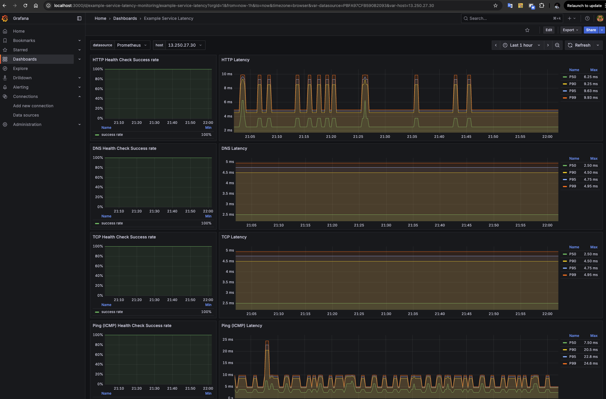

# Latency 404

Simple web service for monitoring network latency.

- [Latency 404](#latency-404)
  - [Prerequisites](#prerequisites)
  - [How to run?](#how-to-run)
    - [Local](#local)
  - [AWS](#aws)
  - [Architecture](#architecture)
    - [Monitoring service](#monitoring-service)
    - [Example-service](#example-service)
  - [Technologies](#technologies)
    - [CICD](#cicd)
    - [Artifacts](#artifacts)
    - [Hosting](#hosting)
    - [Building the services and Collecting the metrics](#building-the-services-and-collecting-the-metrics)
  - [How to view metrics?](#how-to-view-metrics)

## Prerequisites

- Docker
- Docker Compose
- Terraform
- AWS CLI
- Make
- Python

## How to run?

### Local

Run locally on your machine, suitable for local development and testing.

```bash
make local
```

To see the metrics, deploy Grafana and Prometheus.

```bash
make monitoring
```

Then, on your browser, navigate to:

- `http://localhost:3000` for Grafana (username: admin, password: admin)
- `http://localhost:9090` for accessing monitoring services
- `http://localhost:8000` for the web server (example-service)

To destroy the local environment, run:

```bash
make clean-local
make clean-monitoring
```

## AWS

Make sure you have configure the AWS credentials properly.

Initialize the AWS environment using Terraform.

```bash
cd deploy/infra/aws
terraform init
terraform plan
terraform apply
```

Notice there will be an output `monitoring_ec2_public_ip`, copy this IP address.

Go to this file [docker-compose.yaml](./deploy/docker/config/prometheus/prometheus.yml), uncomment line 24-33, change the target to the ip address above.

```yaml
  # For example, the out put of `monitoring_ec2_public_ip` is 123.123.123.123
  - job_name: "monitoring-service-cloud"
    scrape_interval: 15s
    static_configs:
      - targets: ["123.123.123.123:9090"]
        metrics_path: /metrics
    relabel_configs:
      - source_labels: [__address__]
        regex: '([^:]+):\d+'
        target_label: host
        replacement: "${1}"
```

Then, to see the metrics, deploy Grafana and Prometheus on your local machine.

```bash
make monitoring
```

Then, on your browser, navigate to:

- `http://localhost:3000` for Grafana (username: admin, password: admin)
- `http://<monitoring_ec2_public_ip>:9090` for accessing monitoring services

To destroy the local environment, run:

```bash
make clean-monitoring
```

## Architecture


All of the components are hosted within `ap-southeast-1` (Singapore) region.

For the baseline components, just like many other AWS architectures, we have the following:

1. **VPC**: A VPC named `example` that consists of 1 public subnet and 1 private subnet. Of course there will be Internet gw, NAT gw and Route Tables configured to allow traffic flow.
2. **Route 53**: A Route 53 PRIVATE Hosted Zone for internal DNS resolution. The domain name is `example-corp.internal`.

The main part of the architecture is 2 EC2 instances running within the created VPC.

1. **monitoring-service EC2 instance**: A service that periodically checks the latency of the web server. This EC2 instance is deployed in the public subnet.
2. **example-service EC2 instance**: A simple web server exposes a health check endpoint for monitoring. This EC2 instance is deployed in the private subnet.

### Monitoring service

The monitoring service is responsible for checking the latency of the web server.

There are 4 type of latency checks performed by the monitoring service:

1. **HTTP Latency**: Measures the time taken to receive a response from the web server for a specific HTTP request.
2. **TCP Latency**: Measures the time taken to establish a TCP connection to the web server.
3. **DNS Latency**: Measures the time taken to resolve the domain name of the web server.
4. **ICMP Latency**: Measures the time taken for an ICMP ping request to reach the web server and receive a response.

By default, all latency checks are performed every 15 seconds. It can be changed by modifying the `CHECK_INTERVAL` environment variable in [docker-compose.yaml](./monitoring-service/deploy/docker/docker-compose.yaml).

Or you can request to `/check` to tell the monitoring service to perform a latency check immediately.

The collected metrics can be viewed by requesting the `/metrics` endpoint on port (9090).

Here are the list of collected metrics:

| Metric Name | Type | Labels | Description |
|-------------|------|--------|-------------|
| `http_health_check_total` | Counter | `target`, `status` | Total number of HTTP health checks performed |
| `tcp_health_check_total` | Counter | `target`, `status` | Total number of TCP health checks performed |
| `ping_health_check_total` | Counter | `target`, `status` | Total number of ping health checks performed |
| `dns_health_check_total` | Counter | `target`, `status` | Total number of DNS resolution checks performed |
| `http_response_time_seconds` | Histogram | `target` | HTTP response time in seconds |
| `tcp_response_time_seconds` | Histogram | `target` | TCP connection establishment time in seconds |
| `ping_response_time_seconds` | Histogram | `target` | ICMP ping response time in seconds |
| `dns_response_time_seconds` | Histogram | `target` | DNS resolution time in seconds |

### Example-service

A simple web server that accepts TCP/HTTP/ICMP requests. Serves as a target for the monitoring service.

The local DNS name is always `example.example-corp.internal`.

It exposes `/notes?content=<note>` endpoint for writting a newline to a localfile. And a `/health` endpoint for checking the health status.

## Technologies

### CICD

As the project source code is in Github, Github Actions is my number 1 choice, simple, fast and not set up required.

For CI, there is a Github Actions CI pipeline called `Build & publish images` that automatically builds and publishes Docker images for the monitoring service and web server every time there is a commit to the main branch.

For CD, at the beginning, I thought about using a self-hosted runner to run CD securely but the AWS free-tier budget doesn't allow me to do so. So I wrote a simple cronjob that mimics the behavior of `GitOps` by periodically (3 minutes) pull the latest commits and run `docker compose up` again (You can check the logic at [monitoring-service user-data.sh](./monitoring-service/deploy/ec2/user-data.sh) or [example-service user-data.sh](./example-service/deploy/ec2/user-data.sh)).

### Artifacts

OCI image is a global standard for packaging and distributing applications now.

I choose `docker` for building and running the services.

And Github container registry for storing the images.

### Hosting

EC2 and ECS are both viable options for hosting the services.

I choose EC2 with linux based AMI (Ubuntu) for its flexibility, control over the environment.

I also use Docker for easy manage the processes, automation and dependencies of the services.

### Building the services and Collecting the metrics

I choose Python with Flask as it simplifies the process of creating RESTful APIs and handling HTTP requests.

For collecting the metrics, Python libraries like `requests`, `socket` or `ping cli` are used.

For storing and visualizing the metrics, Prometheus + Grafana are used. Prometheus is responsible for scraping and storing the metrics, while Grafana is used to create dashboards and visualize the data.

## How to view metrics?

After deploying Grafana and Prometheus, you can access the Grafana dashboard by navigating to `http://localhost:3000` in your web browser. The default login credentials are:

- Username: `admin`
- Password: `admin`

The datasource and dashboard are already configured, so you can start monitoring the metrics right away by looking at the dashboard named `Example Service Latency`.


